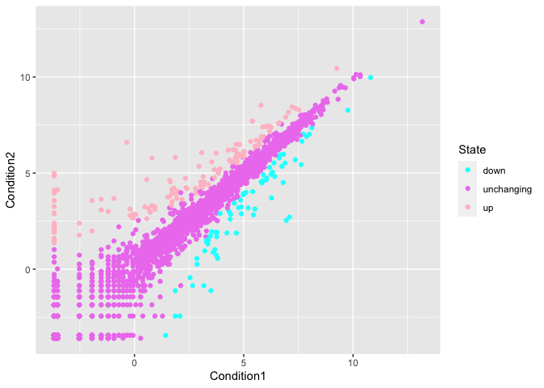
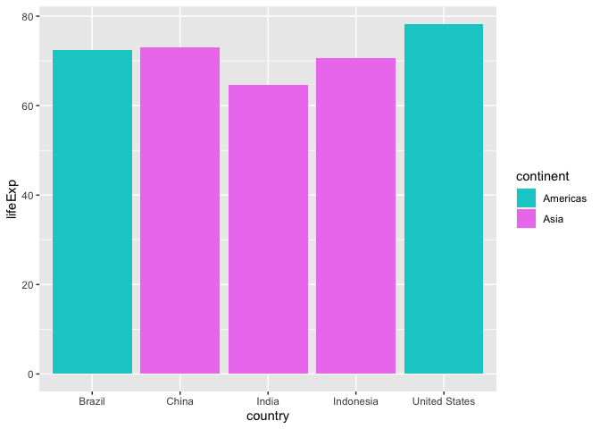
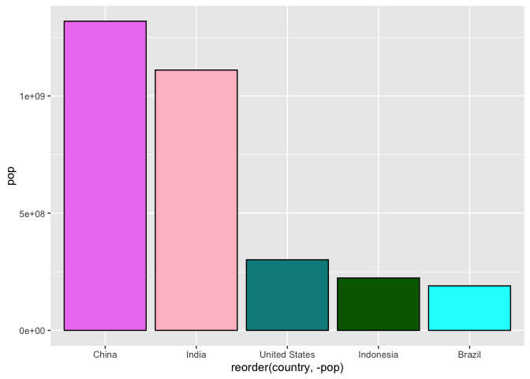

# Class 05 October 18, 2023 Data Visualization w ggplot
Savannah Bogus(A69027475)

## Using GGPLOT :)

First, we have to install it onto our computers using
`install.packages()` but only do this once. Don’t forget to LOAD the
LIBRARY using `library(gg.plot2)`

``` r
library(ggplot2)
ggplot(cars)+aes(x=speed,y=dist)+geom_point()
```


You can start adding trend lines using `geom_smooth` and argue with it
to make a linear regression using `method='lm'` and get rid of the
shaded region by using `se=FALSE`

``` r
library(ggplot2)
ggplot(cars)+aes(x=speed,y=dist)+geom_point()+geom_smooth(method='lm',se=FALSE)
```

    `geom_smooth()` using formula = 'y ~ x'


You can start adding labels via `labs()` and start using things like
`title="Malarky"` or whatever.

``` r
library(ggplot2)
ggplot(cars)+aes(x=speed,y=dist)+geom_point()+geom_smooth(method='lm',se=FALSE)+theme_bw()+labs(title="Speed and Stopping Distance of Cars",x="Speed of Car (MPH)",y="Stopping Distance (ft)",subtitle="By Savannah Bogus :)", Caption="Dataset:'cars'" )
```

    `geom_smooth()` using formula = 'y ~ x'


We’re going to change gears now into some genomic data now.

``` r
url <- "https://bioboot.github.io/bimm143_S20/class-material/up_down_expression.txt"
genes <- read.delim(url)
head(genes)
```

            Gene Condition1 Condition2      State
    1      A4GNT -3.6808610 -3.4401355 unchanging
    2       AAAS  4.5479580  4.3864126 unchanging
    3      AASDH  3.7190695  3.4787276 unchanging
    4       AATF  5.0784720  5.0151916 unchanging
    5       AATK  0.4711421  0.5598642 unchanging
    6 AB015752.4 -3.6808610 -3.5921390 unchanging

Next, I have to find out how many genes are actually in this
dataset.using `nrow()` and then find the number of columns and names of
the columns

``` r
nrow(genes)
```

    [1] 5196

``` r
ncol(genes)
```

    [1] 4

``` r
colnames(genes)
```

    [1] "Gene"       "Condition1" "Condition2" "State"     

Now, I’m going to find how many upregulated genes there are in the
“State” column above. I will do this using `table()` and find the
fraction of genes upregulated to two sigfigs. That was actually harder
to do, and I had to look at the worksheet. The `round()` function was a
memory jog for me, and the 2 sigfigs was not something I remembered,
either.

``` r
table(genes$State)
```


          down unchanging         up 
            72       4997        127 

``` r
round( table(genes$State)/nrow(genes) * 100, 2 )
```


          down unchanging         up 
          1.39      96.17       2.44 

Now, we’re going to start plotting the genes on ggplot.

``` r
ggplot(genes)+aes(x=Condition1,y=Condition2)+geom_point()
```


There’s more information I can add in the up regulated, downregulated,
or unchanging in this data, which I can represent by color.

``` r
ggplot(genes)+aes(x=Condition1,y=Condition2,col=State)+geom_point()
```


How cna I change colors manually? I’ll show you.(It’s with the
`scale_color_manual(values=c("colors","othercolors","evenmorecolors"))`
thing

``` r
ggplot(genes)+aes(x=Condition1,y=Condition2,col=State)+geom_point()+scale_color_manual(values=c("cyan","violet","pink"))
```



Now for labels on the axes.

``` r
ggplot(genes)+aes(x=Condition1,y=Condition2,col=State)+geom_point()+scale_color_manual(values=c("cyan","violet","pink"))+labs(title="Gene Expression Changes on Drug Treatment",x="Control (no drug)",y="Drug Treatment", subtitle="By Savannah Bogus")
```


We’re changing gears now to new data.

``` r
# File location online
url <- "https://raw.githubusercontent.com/jennybc/gapminder/master/inst/extdata/gapminder.tsv"

gapminder <- read.delim(url)
```

Now, we’re going to use something that allows us to look at layers of
the data, in this case, just single years. I installed this thing called
daplyr which I’m supposedly going to learn more about later, but I did
this in the console so that I don’t keep installing it in this document.
Now, I can pull from the library of it.

``` r
library(dplyr)
```


    Attaching package: 'dplyr'

    The following objects are masked from 'package:stats':

        filter, lag

    The following objects are masked from 'package:base':

        intersect, setdiff, setequal, union

``` r
gapminder_2007 <- gapminder %>% filter(year==2007)
ggplot(gapminder_2007) +
  aes(x=gdpPercap, y=lifeExp) +
  geom_point(alpha=0.5)
```


Next, we’re going to add color and population.

``` r
library(dplyr)

gapminder_2007 <- gapminder %>% filter(year==2007)
ggplot(gapminder_2007) +
  aes(x=gdpPercap, y=lifeExp,color=continent,size=pop) +
  geom_point(alpha=0.5)
```


Let’s see how the graph changes when we use color from a numeric value

``` r
library(dplyr)

gapminder_2007 <- gapminder %>% filter(year==2007)
ggplot(gapminder_2007) +
  aes(x=gdpPercap, y=lifeExp,color=pop,size=continent) +
  geom_point(alpha=0.5)
```

    Warning: Using size for a discrete variable is not advised.


Size by continent was very silly looking. However, size by population
doesn’t scale proportionally. Let’s make it so that it does.

``` r
library(dplyr)

gapminder_2007 <- gapminder %>% filter(year==2007)
ggplot(gapminder_2007) +
  aes(x=gdpPercap, y=lifeExp,color=continent,size=pop) +
  geom_point(alpha=0.5)+
  scale_size_area(max_size=15)
```


I made my points bigger to add even more whimsy, but honestly, I think
my plot looks worse.

Next, I’m going to compare the same plot to the data in 1957.

``` r
library(dplyr)

gapminder_1957 <- gapminder %>% filter(year==1957)
ggplot(gapminder_1957) +
  aes(x=gdpPercap, y=lifeExp,color=continent,size=pop) +
  geom_point(alpha=0.7)+
  scale_size_area(max_size=15)
```


I changed the point opacity to be 70% and I hated it more than the 50%
opacity. I’m going to change it back to 50% in the next plot. The next
plot will compare the two years.I don’t understand where the facet_wrap
goes, though

``` r
library(dplyr)

gapminder_1957vs2007 <- gapminder %>% filter(year==1957|year==2007)
ggplot(gapminder_1957vs2007) +
  aes(x=gdpPercap, y=lifeExp,color=continent,size=pop) +
  geom_point(alpha=0.5)+
  scale_size_area(max_size=10)+
  facet_wrap(~year)+scale_color_manual(values=c("cyan","violet","pink","darkcyan","darkorange"))
```


I’m gonna do optional bar charts because it’s still pretty early in
class right now.

``` r
gapminder_top5 <- gapminder %>% 
  filter(year==2007) %>% 
  arrange(desc(pop)) %>% 
  top_n(5, pop)
```

``` r
ggplot(gapminder_top5) + 
  geom_col(aes(x = country, y = pop))
```


``` r
ggplot(gapminder_top5) + 
  geom_col(aes(x = country, y = lifeExp,fill=continent))+
  scale_fill_manual(values=c("cyan3","violet"))
```



Next, we’re going to graph the color to be life expectancy. I spent a
good 20 minutes googling around to change the colors because I like to
inject whimsy into my life, and I want to fill some time. I’m not sure
what the `space=""` line means or the `guide=""` line means, but I did
it.

``` r
ggplot(gapminder_top5) + 
  geom_col(aes(x = country, y = pop,fill=lifeExp))+
  scale_color_gradient(
  low = "cyan",
  high = "violet",
  space = "Lab",
  na.value = "pink",
  guide = "colorbar",
  aesthetics = "fill"
)
```


``` r
ggplot(gapminder_top5) + 
  geom_col(aes(x = reorder(country,-pop), y = pop,fill=lifeExp))+
  scale_color_gradient(
  low = "cyan2",
  high = "darkgreen",
  space = "Lab",
  na.value = "violet",
  guide = "colorbar",
  aesthetics = "fill"
)
```


``` r
ggplot(gapminder_top5) +
  aes(x=reorder(country, -pop), y=pop, fill=country) +
  geom_col(col="black") +
  guides(fill="none")+
  scale_fill_manual(values=c("cyan","violet","pink","darkgreen","darkcyan"))
```



Now we’re flipping bar charts.

``` r
USArrests$State <- rownames(USArrests)
ggplot(USArrests) +
  aes(x=reorder(State,Murder), y=Murder) +
  geom_col() +
  coord_flip()
```


``` r
ggplot(USArrests) +
  aes(x=reorder(State,Murder), y=Murder) +
  geom_point() +
  geom_segment(aes(x=State, 
                   xend=State, 
                   y=0, 
                   yend=Murder), color="darkcyan") +
  coord_flip()
```


