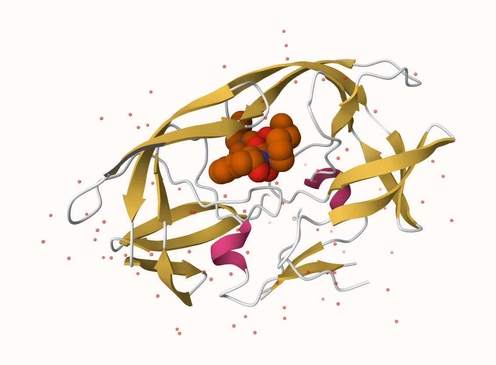
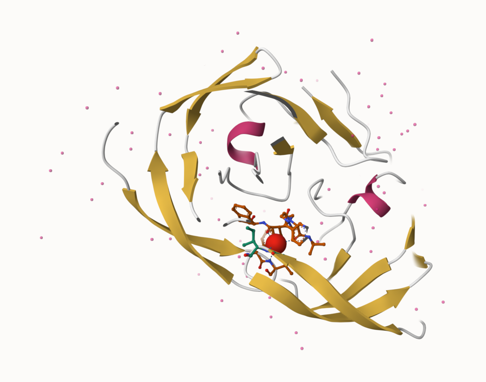
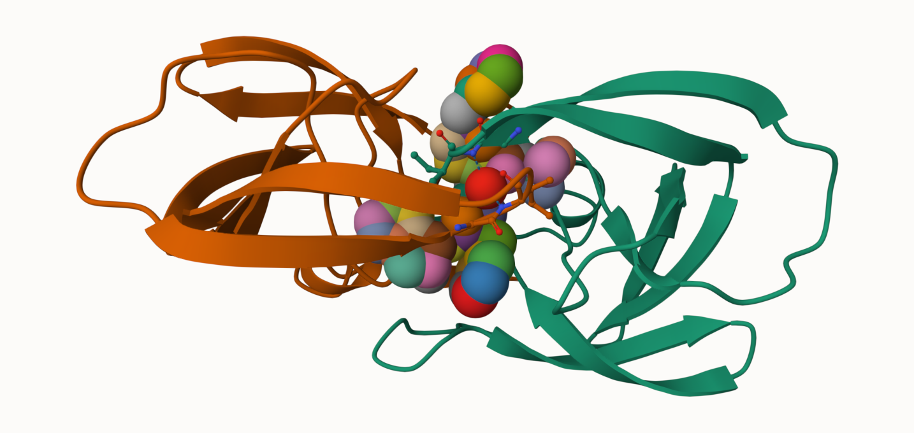
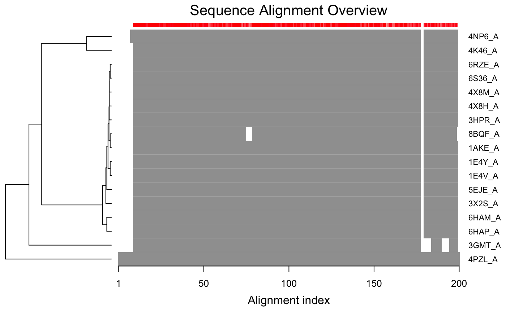

At this moment, there are 183,201 protein structures. In UniProt, there are 251,600,768 protein sequences. 

```{r}
stats<-read.csv("Data Export Summary.csv", row.names=1)
head(stats)
```
Note that because of the comma in the numbers, all of your numbers look like character strings :(
`as.numeric` won't work with the commas. 
So, we're going to write a function that can remove commas any time. I used Claude to figure this out, as you suggested. There's a function called `sub()` in R that will substitute the first thing, but `gsub()` is a global substitution that can find a pattern and replace it globally, hence why Claude suggested that to me. 

```{r}
remove_commas<-function(x){
  #replace commas with nothing and convert to numeric
  as.numeric(gsub(",","",x))

}
```

```{r}
str1<-"1,234"
remove_commas(str1)

```

Now we have to use apply and apply it on the pdb thing. 

```{r}
pdbstats <- apply(stats,2,remove_commas)
```

We gotta do the row names thing again I think. If you do `rownames()` of stats vs. pdbstats, pdbstats returns a NULL.

```{r}
rownames(pdbstats) <- rownames(stats)
pdbstats
```


# Q1 

About 93% of the structures in PDB are solved by X-ray and EM. Mostly by X-ray. I asked this to Claude, but you're about to have us do code for it. Which I just found out is betterbecause Claude was wrong.

```{r}
totals<- apply(pdbstats,2,sum)
round(totals/totals["Total"]*100,2)
```


# Q2-Q3

We're skipping these


## Visualizing the HIV-1 protease structure

# Q4

There's only one atom per water molecule because the resolution is 2.00 Angstroms, and Hydrogen is smaller than that. 

HIV-Pr image below.



# Q5 

Water 308 is conserved. 

# Q6




# Q7 [optional]

That area that the H2O 308 binds wouldn't be there without the homodimer. 

## Introduction to Bio3D in R

```{r}
library(bio3d)
pdb<-read.pdb("1hsg")
pdb

```

# Q7 [for real this time]

198

# Q8

HOH (water) and MK1 (ligand)

# Q9

There are 2 chains in the structure. 

```{r}
attributes(pdb)
head(pdb$atom)
```
```{r}
adk<-read.pdb("6s36")
adk
```

Looks like we're doing a normal mode analysis (NMA) which predicts protein flexibility and potential functional motions/conformational changes.

```{r}
#flexibility prediciton
m<-nma(adk)
plot(m)
```

To view a “movie” of these predicted motions we can generate a molecular “trajectory” with the mktrj() function.

```{r}
mktrj(m,file="adk_modes.pdb")
```

## Comparative structure analysis of Adenylate Kinase


# Q10

msa is the package found on bioconductor and not CRAN

# Q11

# Q12

devtools can be used to install packages from github and bitbucket. 

```{r}
aa<-get.seq("1ake_A")
aa
```

# Q13

214 amino acids. 

```{r}
blast<-blast.pdb(aa)
hits<-plot(blast)

```

```{r}
#hit em with the top hits
head(hits$pdb.id)
```
Now we're going to download related PDB files. I don't understand this code. That's probably my fault. 
```{r}
files<-get.pdb(hits$pdb.id,path="pdbs",split=TRUE,gzip=TRUE)
```
Now we can align and superimpose structures. `pdbaln()` is how we align.

```{r}
pdbalign<-pdbaln(files,fit=TRUE,exefile="msa")
```
Now I'm going to make a vector containing PDB codes for figure axes and then draw a schematic alignment.

```{r}
ids<-basename.pdb(pdbalign$id)
#plot(pdbalign,labels=ids, dev='png')
```



My plot doesn't have the sequence alignment overview? 
>>>>>>me from the future couldn't render because of this plot so I asked Claude and Claude told me to set `dev='png'` or any other raster format which worked beautifully and fixed my plot
And apparently my plot will NOT render because the "figure margins are too large" no matter what I try or what I ask Claude to do or even asking a coding friend what to do. I inserted the png so you know I did it, and then I made the plot code a comment so that I can actually render this whole thing. 
Now apparently I can annotate

```{r}
anno<-pdb.annotate(ids)
unique(anno$source)
anno
```
Alright, time to start performing PCA.

```{r}
pc.xray<-pca(pdbalign)
plot(pc.xray)
```
Next we're going to calculate RMSD.

```{r}
rd<-rmsd(pdbalign)

#structure-based clustering??
hc.rd<-hclust(dist(rd))
grps.rd<-cutree(hc.rd,k=3)

plot(pc.xray,1:2,col="darkcyan",bg=grps.rd,pch=21,cex=1)
```

## Optional further visualization

We can VISUALIZE the principal components!

```{r}
pc1<- mktrj(pc.xray,pc=1,file="pc_1.pdb")
```

CRAZY.

we can also plot this in ggplot and with ggrepel.

```{r}
library(ggplot2)
library(ggrepel)

df<-data.frame(PC1=pc.xray$z[,1],
               PC2=pc.xray$z[,2],
               col=as.factor(grps.rd),
               ids=ids)

p<-ggplot(df)+
  aes(PC1,PC2,col=col,label=ids)+
  geom_point(size=1)+
  geom_text_repel(max.overlaps=20)+
  theme(legend.position="none")+
  scale_color_manual(values=c("darkcyan","pink","violet"))

p
```

## Normal Mode Analysis

```{r}
modes<-nma(pdbalign)
plot(modes,pdbalign,col=grps.rd)
```

# Q14 

A lot of the upper lines are almost like an amplified version of the black lines. I think it indicates areas that are not as conserved and are able to have fluctuations without impacting main function as majorly. 
