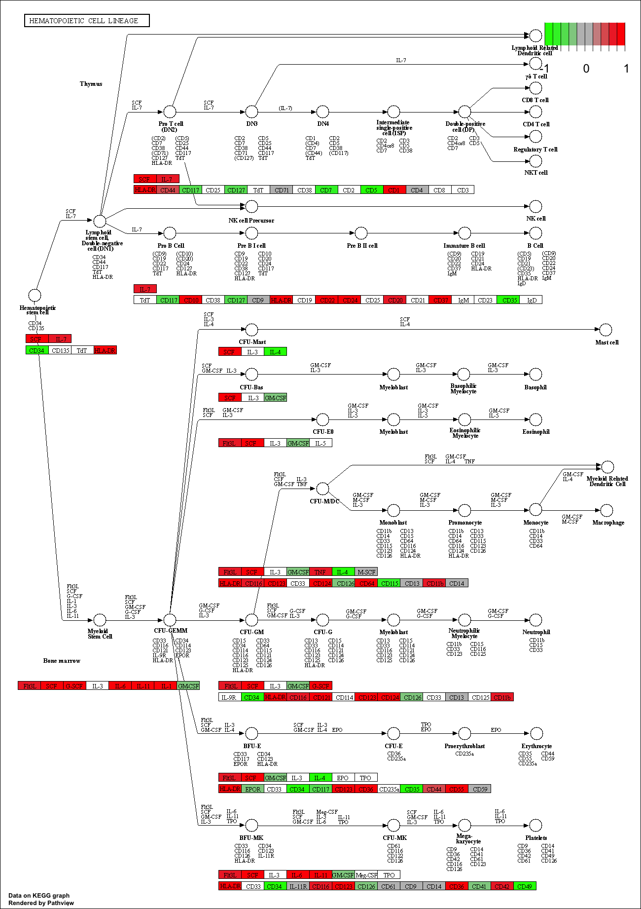
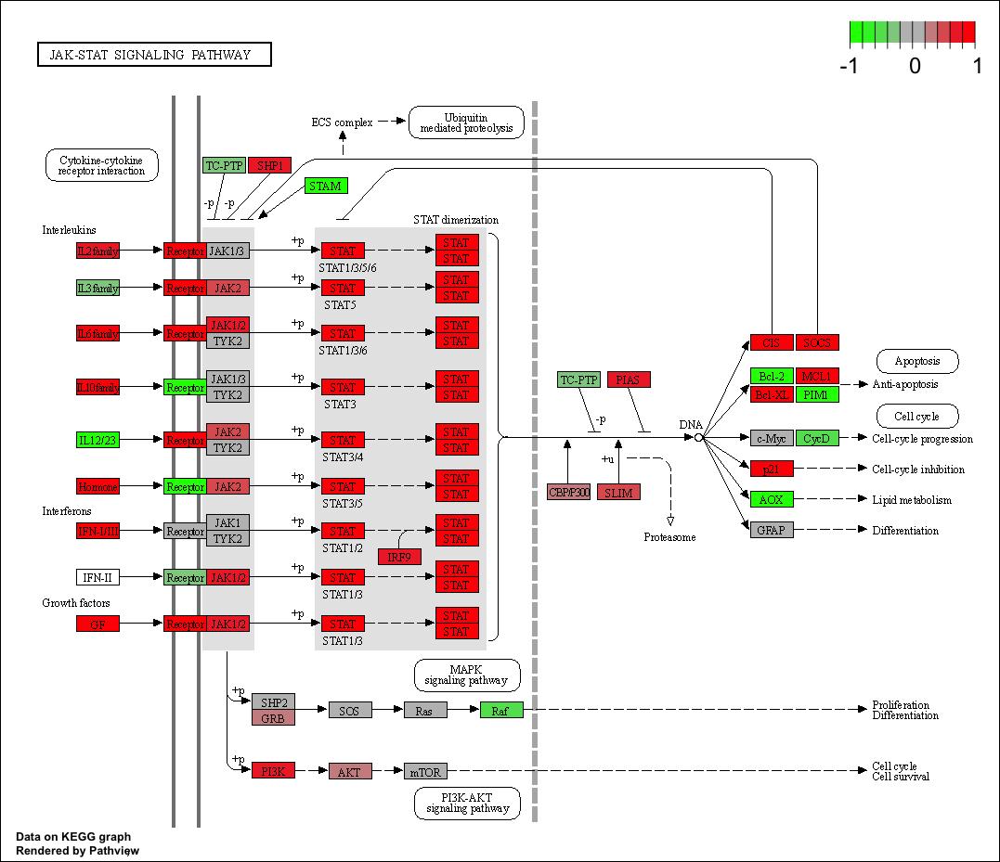
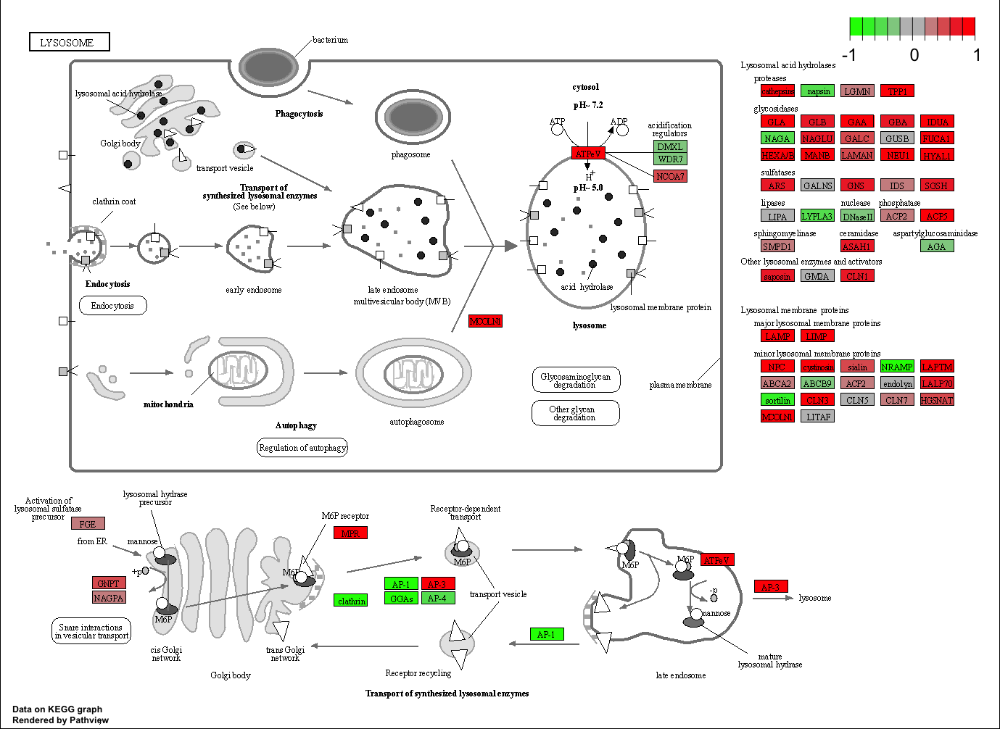
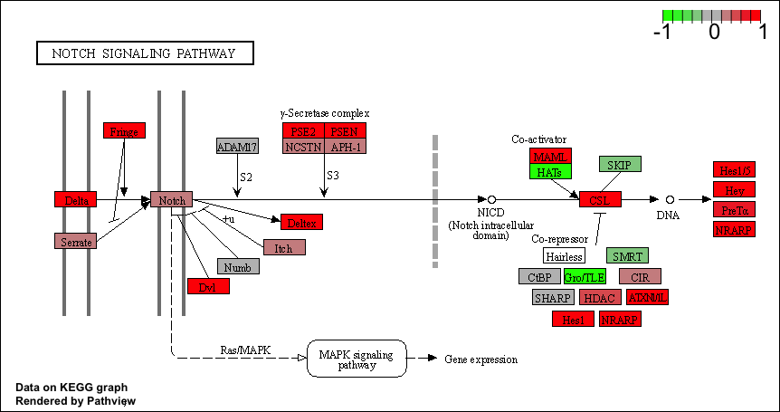
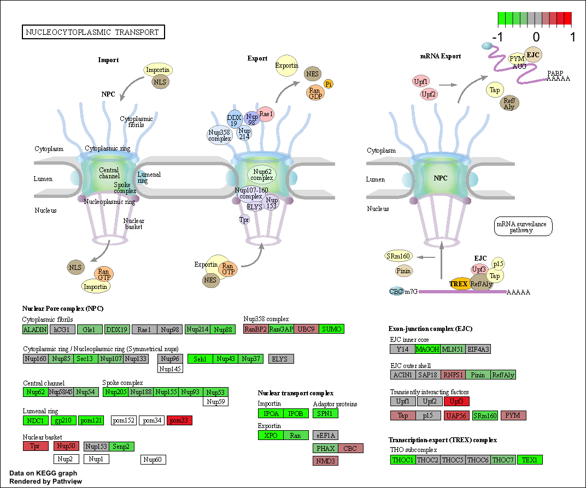
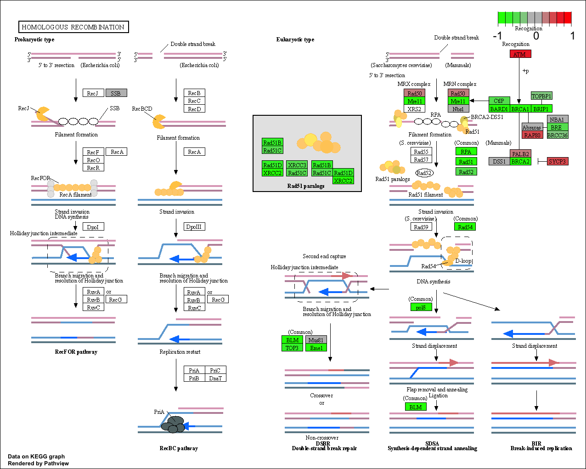

## Differential Expression Analysis

```{r}
library(DESeq2)

```

```{r}
metaFile <- "GSE37704_metadata.csv"
countFile <- "GSE37704_featurecounts.csv"

# Import metadata
colData = read.csv(metaFile, row.names=1)
head(colData)

# Import countdata
countData = read.csv(countFile, row.names=1)
head(countData)
```

I need to remove the weird column though.

```{r}
countData <- as.matrix(countData[,-1])
head(countData)
```

Now I have to get rid of the zeros. 

```{r}
countData = countData[-which(rowSums(countData)==0), ]
head(countData)
```

```{r}
dds = DESeqDataSetFromMatrix(countData=countData,
                             colData=colData,
                             design=~condition)
dds = DESeq(dds)
```

```{r}
res=results(dds)
summary(res)
```

```{r}
plot( res$log2FoldChange, -log(res$padj),col="darkcyan" )
```

```{r}
# Make a color vector for all genes
mycolors <- rep("cyan", nrow(res) )

#coloring genes with fold change above 2
mycolors[ abs(res$log2FoldChange) > 2 ] <- "violet"

# coloring genes w adjusted p-value less than 0.01
#  and absolute fold change more than 2
inds <- (res$padj<0.01) & (abs(res$log2FoldChange) > 2 )
mycolors[ inds ] <- "darkcyan"

plot( res$log2FoldChange, -log(res$padj), col=mycolors, xlab="Log2(FoldChange)", ylab="-Log(P-value)" )
```

```{r}
library("AnnotationDbi")
library("org.Hs.eg.db")

columns(org.Hs.eg.db)

res$symbol = mapIds(org.Hs.eg.db,
                    keys=row.names(res), 
                    keytype="ENSEMBL",
                    column="SYMBOL",
                    multiVals="first")

res$entrez = mapIds(org.Hs.eg.db,
                    keys=row.names(res),
                    keytype="ENSEMBL",
                    column="ENTREZID",
                    multiVals="first")

res$name =   mapIds(org.Hs.eg.db,
                    keys=row.names(res),
                    keytype="ENSEMBL",
                    column="GENENAME",
                    multiVals="first")

head(res, 10)
```

```{r}
res = res[order(res$pvalue),]
write.csv(res, file="deseq_results.csv")
```

## Pathway Analysis

```{r}
library(pathview)
library(gage)
library(gageData)
data(kegg.sets.hs)
data(sigmet.idx.hs)
```

Now, I'm going to limit it to signaling and metabolic pathways.

```{r}
kegg.sets.hs = kegg.sets.hs[sigmet.idx.hs]
head(kegg.sets.hs, 3)
```
We have to get ready for the gage function format, which is what I'm doing here. 

```{r}
foldchanges = res$log2FoldChange
names(foldchanges) = res$entrez
head(foldchanges)
```

Next, I'm actually using the gage function, with `same.dir=TRUE` to help with order. 

```{r}
keggres = gage(foldchanges, gsets=kegg.sets.hs,same.dir=TRUE)
attributes(keggres)
```

Checking out what is downregulated. 

```{r}
head(keggres$less)
```
And finally getting the pathview look at the pathway, inserted below. 

```{r}
pathview(gene.data=foldchanges, pathway.id="hsa04110")
```

Next, I'm going to focus on the top 5 pathways.

```{r}
keggrespathways <- rownames(keggres$greater)[1:5]
```
Get the 8 character ID.

```{r}
keggresids = substr(keggrespathways, start=1, stop=8)
keggresids
```

```{r}
pathview(gene.data=foldchanges, pathway.id=keggresids, species="hsa")
```








# Same procedure for the downregulated. 

First, get the top 5 downregulated pathways.

```{r}
keggrespathwaydown <- rownames(keggres$less)[1:5]
keggresidsdown = substr(keggrespathwaydown, start=1, stop=8)
keggresidsdown
```

```{r}
pathview(gene.data=foldchanges, pathway.id=keggresidsdown, species="hsa")
```






## Gene Ontology

```{r}
data(go.sets.hs)
data(go.subs.hs)

# Just focus on biological process part of GO
gobpsets = go.sets.hs[go.subs.hs$BP]

gobpres = gage(foldchanges, gsets=gobpsets, same.dir=TRUE)

lapply(gobpres, head)
```

## Reactome Analysis

```{r}
sig_genes <- res[res$padj <= 0.05 & !is.na(res$padj), "symbol"]
print(paste("Total number of significant genes:", length(sig_genes)))
```

```{r}
write.table(sig_genes, file="significant_genes.txt", row.names=FALSE, col.names=FALSE, quote=FALSE)
```

#Q What pathway has the most significant “Entities p-value”? Do the most significant pathways listed match your previous KEGG results? What factors could cause differences between the two methods?

Cell cycle, mitotic has the most significant entities p-value. It's the same for the KEGG results, interestingly. 